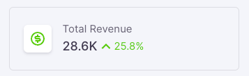
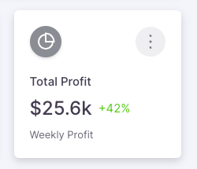
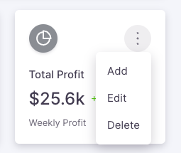
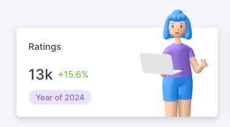

# Card Statistics

### Overview

We have created different version of card component to make it easier for you to show your statistics neatly.

### Card Statistics Horizontal

The `CardStatHorizontal` component is tailored for presenting statistics in a horizontal layout. It's an ideal choice for showcasing key figures such as customer counts, sales numbers, or any other significant data in a visually appealing and easy-to-read format.

Usage:
Here's an example of how to use the `CardStatHorizontal` component:

```tsx
// Component Imports
import CardStatHorizontal from '@components/card-statistics/Horizontal'

const Component = () => {
    return (
        <CardStatHorizontal
        title: 'New Customers'
        stats: '2,856'
        icon: 'ri-group-line'
        color?: 'success'
        trendNumber: '25.8%'
        trend?: 'up'
        />
    )
} 

export default Component
```

Result:



### Props

| Prop         | Type                                                                    | Required | Description                                  |
|--------------|-------------------------------------------------------------------------|----------|----------------------------------------------|
| title        | `string`                                                                  | Yes      | The title displayed on the card              |
| stats        | `string`                                                                  | Yes      | The statistic number displayed on the card   |
| icon         | `string`                                                                  | Yes      | Icon to display inside the avatar            |
| color        | `'primary' \| 'secondary' \| 'success' \| 'error' \| 'warning' \| 'info'` | No       | Color theme for the avatar                   |
| trend        | `'up'`                                                                    | No       | Direction of the trend (upward or downward)  |
| trendNumber  | `string`                                                                  | Yes      | Numerical value indicating the trend         |

### Card Statistics Vertical

The `CardStatVertical` component is adeptly designed for vertically-oriented presentation of key statistics. This format is particularly suitable for detailed data display, where additional information such as subtitles and icons enhances the understanding of the metrics.

To utilize the `CardStatVertical` component in your application:

```tsx
// Component Imports
import CardStatVertical from '@components/card-statistics/Vertical'

<CardStatVertical
  title='Total Profit'
  stats='$25.6k'
  avatarIcon='ri-pie-chart-2-line'
  avatarColor='secondary'
  subtitle='Weekly Profit'
  trendNumber='42%'
  trend='positive'
  moreOptions={{ options: ['Add', 'Edit', 'Delete'] }}
/>
```
Results:




### Props

| Prop         | Type                                                | Required | Description                                      |
|--------------|-----------------------------------------------------|----------|--------------------------------------------------|
| title        | `string`                                            | Yes      | The title displayed at the top of the card       |
| stats        | `string`                                            | Yes      | The main statistic number displayed              |
| avatarIcon   | `string`                                            | Yes      | Icon displayed inside the avatar                 |
| subtitle     | `string`                                            | Yes      | A brief description or subtitle                  |
| avatarColor  | `'primary' \| 'secondary' \| 'success' \| 'error' \| 'warning' \| 'info'` | No | Color theme for the avatar (optional)           |
| trendNumber  | `string`                                            | Yes      | Percentage showing the change in numbers         |
| trend        | `positive \| negative`                              | No       | Indicates if the trend is positive or negative   |
| avatarSkin   | `CustomAvatarProps['skin']`                         | No       | Skin style for the avatar (optional)             |
| avatarSize   | `number `                                           | No       | Size of the avatar (optional)                    |
| moreOptions  | `OptionsMenuType`                                   | No       | Additional options for the card (optional)       |


### Card Statistics Image

The `CardStatWithImage` component offers a creative way to feature statistics along with a related image, providing a visual context that enhances the data representation.

Here's how to implement the `CardStatWithImage` component in your application:

```tsx
// Component Imports
import CardStatWithImage from '@components/card-statistics/Character'

<CardStatWithImage
  stats='13k'
  title='Ratings'
  trendNumber='15.6%'
  chipColor='primary'
  src='/images/illustrations/characters/13.png'
  chipText={`Year of ${new Date().getFullYear()}`}
/>
```

Results:



### Props

| Prop        | Type                               | Required | Description                                       |
|-------------|------------------------------------|----------|---------------------------------------------------|
| src         | `string`                           | Yes      | Image source URL                                  |
| title       | `string`                           | Yes      | Title displayed above the statistics              |
| stats       | `string`                           | Yes      | Main statistic number displayed                   |
| chipText    | `string`                           | Yes      | Text displayed inside the chip                    |
| trendNumber | `string`                           | Yes      | Numerical value indicating the trend              |
| chipColor   | `'primary' \| 'secondary' \| 'success' \| 'error' \| 'warning' \| 'info'` | No | Color of the chip (optional)                     |
| trend       | `'positive' \| 'negative'`         | No       | Indicates the trend direction (optional)          |
